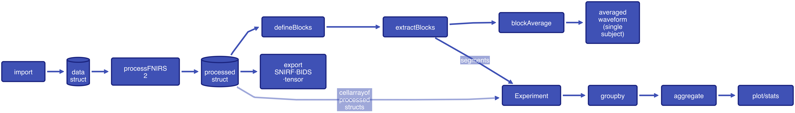
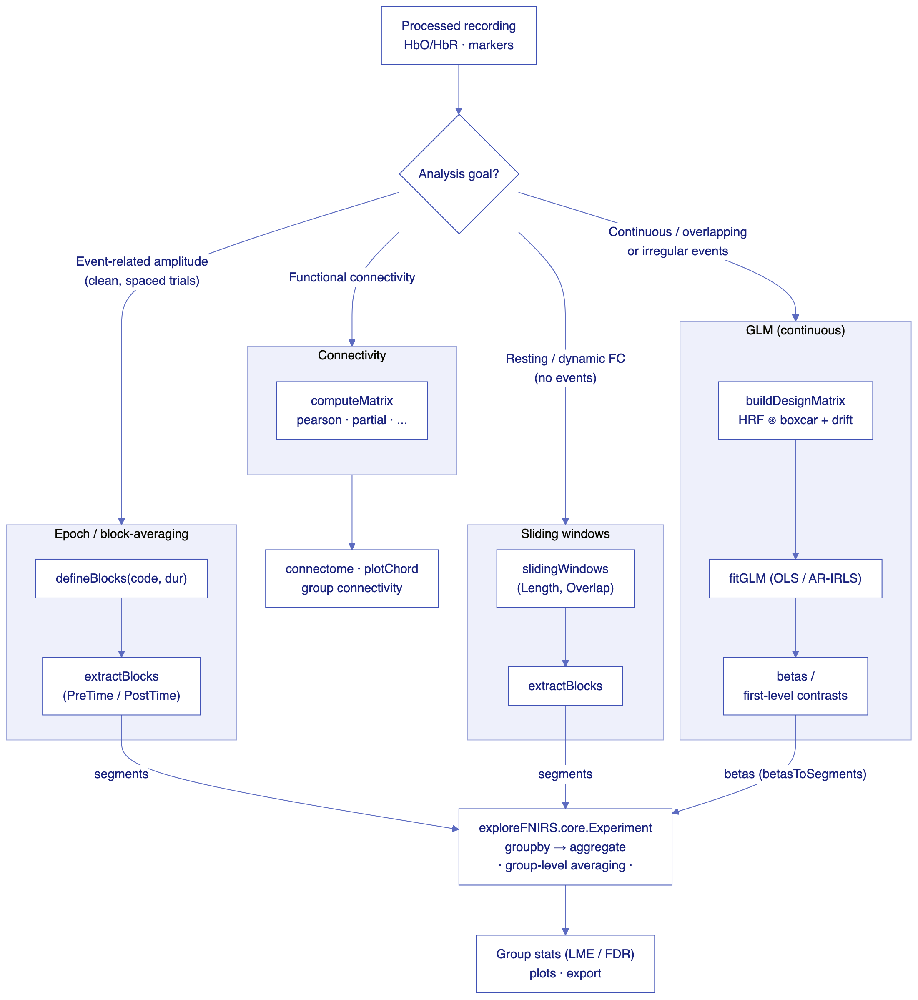

# processFNIRS2


A modular MATLAB toolbox for functional Near-Infrared Spectroscopy (fNIRS) data
analysis — covering the full workflow from raw device import through signal
processing, hemoglobin conversion, quality control, visualization, and
group-level statistics.

processFNIRS2 is organized in two layers: **Layer 1 (`pf2`)** handles
single-subject import and processing; **Layer 2 (`exploreFNIRS`)** handles
multi-subject group analysis and statistics. The boundary between them is a
plain processed-data struct, so you can script the whole pipeline headlessly or
drive it through the GUI.

## Architecture at a glance

From a device file to group statistics — `import → processFNIRS2 → epoch →
Experiment`, with `export` available off the processed struct:



Once data is processed, the analysis approach follows the experimental design.
`extractBlocks` segments feed the `Experiment` (whose `aggregate` step does
group-level averaging); `blockAverage` is the single-subject form; GLM betas
enter via `betasToSegments`:



For the full set of diagrams (package map, GLM, hyperscanning) see
[docs/ARCHITECTURE.md](docs/ARCHITECTURE.md).

## Contents
- [Architecture at a Glance](#architecture-at-a-glance)
- [Key Features](#key-features)
- [Requirements](#requirements)
- [Installation](#installation)
- [Quick Start](#quick-start)
- [Core Concepts](#core-concepts)
- [Common Workflows](#common-workflows)
- [Documentation](#documentation)
- [Examples & Tutorials](#examples--tutorials)
- [Project Structure](#project-structure)
- [Settings Configuration](#settings-configuration)
- [Troubleshooting](#troubleshooting)
- [Contributing](#contributing)
- [License](#license) · [Citation](#citation) · [Contact](#contact)

## Key Features

**Import** — fNIR Devices/Biopac (`.nir`), Hitachi ETG-4000, NIRx, Artinis
OxySoft (`.oxy3`), and SNIRF (auto-reads BIDS `events.tsv`); batch import from a
directory tree; tidy/long-format tables via `fromTable`; re-import learned
embeddings.

**Process** — configurable three-stage pipeline (raw → optical density →
hemoglobin); motion correction (TDDR, SMAR, wavelet, spline); FIR/Butterworth
filtering; age- and wavelength-dependent DPF (Scholkmann 2013). Signal-processing
and wavelet routines are first-party, so the default pipeline needs no Signal
Processing or Wavelet Toolbox.

**Quality control** — headless QC pipeline and one-call `snapshot` (Scalp
Coupling Index, saturation, cardiac, CoV, Takizawa), plus an interactive
channel-check GUI.

**Analysis** — block/grand averaging, GLM (with `GLMExperiment`), ROI analysis,
functional connectivity (7 coupling methods), dynamic FC with brain-state
detection, graph-theoretic metrics, hyperscanning/inter-brain synchrony and
cross-brain PPI, and LME-based group statistics with FDR correction.

**Visualization** — time series, topographic maps (2D and 3D cortical surface),
high-quality brain renders, activation movies, Brodmann-parcel projection,
brain-anchored connectomes, dual-brain synchrony, and diffuse optical
tomography (DOT) image reconstruction.

**Export & interchange** — NIR, SNIRF, true BIDS-NIRS datasets, CSV/MATLAB
tables, and self-describing HDF5 tensors for foundation/transformer models.

## Requirements
- **MATLAB R2025b** recommended.
- **Statistics and Machine Learning Toolbox** — required for LME-based group
  statistics in exploreFNIRS.
- No other toolboxes are required for the default pipeline: filtering, wavelet,
  Savitzky-Golay, and median-filter routines are implemented first-party (in
  `+pf2_base/+external` and `+pf2_base/+wavelet`).
- **Signal Processing Toolbox** — *not* needed for the core processing/filtering
  pipeline, but still required for **spectral estimation** features: the QC power
  spectrum (`pf2.qc.powerSpectrum`, uses `pwelch`/`findpeaks`), coherence-based
  connectivity (`exploreFNIRS.coupling.coherence`/`partialCoherence`, uses
  `cpsd`/`mscohere`), and the optional equiripple-FIR filter variant (`remez`,
  the `ft==2` path in `pf2_lpf`). Porting these is tracked in
  `internal/octave_compatibility.md`.

## Installation
1. Clone or download this repository.
2. Add the processFNIRS2 root folder to your MATLAB path:
   ```matlab
   addpath('/path/to/processFNIRS2');
   ```
   That is all that is required. The package folders (`+pf2`, `+pf2_base`,
   `+exploreFNIRS`) resolve automatically once the root is on the path, and the
   loose code folders (`base_functions`, `functions`, `GUI`) are added for you on
   the first call to `processFNIRS2` (or `pf2`) — no manual `addpath` of
   subdirectories is needed.

Verify the install with a one-line smoke test:
```matlab
data = pf2.import.sampleData.fNIR2000(); processed = processFNIRS2(data); disp('Done')
```

## Quick Start
```matlab
% Import data (use the bundled sample, or import your own file)
mydata = pf2.import.sampleData();                 % sample recording with markers
% mydata = pf2.import.importNIR('myNIRSfile.nir'); % ...or import your own file

% Process to hemoglobin. Assigning an output runs headless (GUI suppressed):
processed = processFNIRS2(mydata);                % uses the default methods

% To pick specific methods, browse the registered names and select one:
pf2.methods.raw.list();                           % e.g. 'x2_lpf_smar', 'x5_TDDR'
pf2.methods.oxy.list();
pf2.methods.raw.setMethod('x5_TDDR');
processed = processFNIRS2(mydata);                % process with the chosen method

% Visualize
pf2.data.plot.oxy(processed);
pf2.data.plot.roi(processed);

% Export
pf2.export.asSNIRF(processed, 'myexport.snirf');

% Explore and analyze (group layer / interactive GUI)
exploreFNIRS(processed);
```
> Assigning an output (`processed = processFNIRS2(...)`) suppresses the GUI.
> Call `processFNIRS2` with **no** output to open the configuration GUI.

### Block average (event-related) in 6 lines
The happy path from a continuous recording with event markers to an averaged
event-related waveform:
```matlab
data     = pf2.import.sampleData();              % recording WITH markers (code 50)
proc     = processFNIRS2(data);                   % -> HbO/HbR/...
blocks   = pf2.data.defineBlocks(proc, 50, 15, 'Embed', false);  % code 50, 15 s duration
segments = pf2.data.extractBlocks(proc, blocks, 'PreTime', 5, 'PostTime', 15, 'SetT0', true);
ga       = pf2.data.blockAverage(segments);       % trial average onto a common grid
plot(ga.time, ga.HbO.Mean(:,1));                  % averaged HbO, channel 1
```
> The 3rd `defineBlocks` argument is the block **duration** in seconds, not a
> window. Always pass explicit `PreTime`/`PostTime` to `extractBlocks` — when
> omitted it falls back to a small default `Buffer` (2 s each side) rather than
> the whole recording.

## Core Concepts

**The data struct is the interface.** Import produces a struct; processing adds
the hemoglobin fields; everything downstream (blocks, plots, Experiment,
export) reads that same struct. The stable fields:

| After import | After `processFNIRS2` |
|--------------|-----------------------|
| `raw` `[T×C]`, `time`, `fs`, `fchMask` | `HbO` `HbR` `HbTotal` `HbDiff` `CBSI` `[T×C]` |
| `markers` (table), `device`, `info`, `Aux` | `units`, `DPF_factor`, `processingInfo` |

**Three-stage pipeline.** Raw intensity → optical density (`processStageRaw2OD`)
→ hemoglobin via Beer-Lambert (`bvoxy`) → filtered hemoglobin
(`processStageFilterHb`). Stage 1 (raw) and Stage 3 (oxy) are configurable
method chains. See [docs/PROCESSING_PIPELINE.md](docs/PROCESSING_PIPELINE.md).

**Markers are a table.** `data.markers` has variables `Time, Code, Duration,
Amplitude` (read by name, not position); extra columns you add are preserved
through processing and splicing. Codes get meaning from the per-dataset marker
dictionary `data.info.markerDict`, which importers populate from BIDS
`events.tsv`/COBI logs and which `defineBlocks` reads to auto-label blocks.

## Common Workflows

Each of the snippets below is the short form; the linked reference and runnable
example go deeper.

### Method configuration & custom pipelines
Configure the raw/oxy method chains through the GUI or programmatically, or
build a chain step-by-step with the Pipeline API (value objects — every mutating
call returns a new copy):
```matlab
pf2.methods.raw.setMethod('x5_TDDR');
pf2.methods.oxy.setMethod('takizawa_easy');

% Build a raw-stage pipeline from scratch
p = pf2_base.RawPipeline('myPipeline');
p = p.add('pf2_Intensity2OD');                 % required first step
p = p.add('pf2_MotionCorrectTDDR');
p = p.add('pf2_lpf', 'freq_cut', 0.08);
out = p.run(data);                             % standard processFNIRS2 output
p.save('raw');                                 % register as a named method
```
Reference: [docs/PROCESSING_PIPELINE.md](docs/PROCESSING_PIPELINE.md) ·
Examples: `examples/scripts/example_pipeline_basics.m`,
`examples/scripts/example_pipeline_custom_function.m`.

### Reproducible & parallel processing (Context)
A `ProcessingContext` bypasses global state, so settings stay isolated — ideal
for testing, `parfor`, and reproducibility:
```matlab
parfor i = 1:numSubjects
    ctx = pf2_base.ProcessingContext.fromGlobals();
    ctx.subjectAge = ages(i);
    ctx.setRawMethod('x5_TDDR');
    ctx.setOxyMethod('takizawa_easy');
    results{i} = processFNIRS2(data{i}, 'Context', ctx);
end
```

### Visualization & export
```matlab
pf2.data.plot.oxy(processed);                              % time series
pf2.probe.plot.topo(processed, 'HbO', 'View', '3d');       % 3D cortical surface
pf2.probe.plot.topo(processed, 'HbO', 'savePath', 'topo.png');  % headless save

pf2.export.asSNIRF(processed, 'out.snirf');
pf2.export.asBIDS(allData, 'bids_out/', 'Task', 'rest');   % BIDS-NIRS dataset
pf2.export.asTensor(processed, 'rec.h5', 'Features', {'HbO','HbR'});  % ML tensor
```
> For headless 3D renders, prefer the `'savePath'` option over
> `figure('Visible','off') + saveas` — it reliably writes a correct
> white-background image. Reference: [docs/API_REFERENCE.md](docs/API_REFERENCE.md).

### GLM analysis
Keep continuous recordings intact and fit HRF-convolved regressors. The
`GLMExperiment` class wraps processing + GLM + group analysis into one object:
```matlab
[subjects, blockDefs] = pf2.import.sampleData.experiment('blocks');
gx = exploreFNIRS.core.GLMExperiment(subjects, blockDefs);
gx.glm.conditions = {'Easy', 'Hard'};
gx.fit();
gx.groupby({'Condition'}); gx.aggregate();
gx.plotBar('Biomarker', 'HbO', 'ShowIndividual', true);
```
Examples: `examples/scripts/example_glm_analysis.m` (and `_advanced`,
`_connectivity`).

### Group analysis & statistics (exploreFNIRS)
Load a cell array of processed subjects into the scriptable `Experiment` class
(or the GUI) for group plots, connectivity, hyperscanning, and LME statistics:
```matlab
ex = exploreFNIRS.core.Experiment(allData);
ex.groupby({'Group', 'Condition'});
ex.aggregate();
ex.plotTemporal('Biomarkers', {'HbO','HbR'});      % group-averaged timeseries
[fig, stats] = ex.plotLME('Biomarkers', {'HbO'});  % LME + F-stat bars
```
> `Experiment` computes task/baseline statistics over **epoched segments**, not
> continuous recordings — extract blocks first, and keep `settings.baseline`
> within each segment's time range.

Reference: [docs/EXPLORERNIRS_PIPELINE.md](docs/EXPLORERNIRS_PIPELINE.md) and
[ExploreFNIRS_README.md](ExploreFNIRS_README.md) · Examples:
`example_experiment_cli.m`, `example_connectivity.m`, `example_hyperscanning.m`.

### Quality control
```matlab
report = pf2.qc.snapshot(data, 'SaveDir', 'qc_out');   % one-call headless summary
report = pf2.qc.pipeline.assess(data);                  % saturation/sci/cardiac/cov/takizawa
data   = pf2.qc.pipeline.apply(data, report);           % AND results into data.fchMask
```
Example: `examples/scripts/example_qc_pipeline.m`.

### Metadata import
```matlab
allData = pf2.data.importInfo(allData, 'demographics.csv', 'SubjectID');  % per subject
blocks  = pf2.data.importBlockInfo(blocks, 'behavior.csv', 'MarkerCode', 49); % per block
```
Example: `examples/scripts/example_import_blocks.m`.

## Documentation
Full reference documentation lives in the [`docs/`](docs/) directory — see
[`docs/README.md`](docs/README.md) for the index:

| Guide | Content |
|-------|---------|
| [API Reference](docs/API_REFERENCE.md) | Package/function reference and device support |
| [Processing Pipeline](docs/PROCESSING_PIPELINE.md) | Three-stage pipeline, methods, configuration |
| [Usage Examples](docs/USAGE_EXAMPLES.md) | Worked single-subject, multi-device, and batch workflows |
| [MATLAB CLI](docs/MATLAB_CLI.md) | Headless execution and automation patterns |
| [CLI/UX Guide](docs/CLI_UX_GUIDE.md) | CLI conventions and progressive-disclosure API |
| [exploreFNIRS Pipeline](docs/EXPLORERNIRS_PIPELINE.md) | Group-analysis layer reference |
| [Architecture](docs/ARCHITECTURE.md) | Data flow, package map, and where new code belongs |

For per-function help in MATLAB, use `help` (e.g. `help processFNIRS2`,
`help pf2.import.importNIR`).

## Examples & Tutorials
Runnable, copy-pasteable scripts live in [`examples/scripts/`](examples/scripts)
— see [`examples/scripts/README.md`](examples/scripts/README.md) for the full
index. Start with:

1. `tutorial_end_to_end.m` — import → process → blocks → Experiment → stats/export.
2. `tutorial_batch_workflow.m` — multi-subject directory import, metadata, batch.
3. Topic examples — pipelines, GLM, QC, connectivity, hyperscanning, DOT, visualization.

## Project Structure
```
processFNIRS2.m      Main processing entry point
pf2.m                Convenience wrapper (self-heals the path)
exploreFNIRS.m       Group-level analysis GUI
+pf2/                User-facing API (import, export, data, methods, settings, probe, qc)
+pf2_base/           Internal infrastructure, algorithms, and tests
+exploreFNIRS/       Group analysis (core, connectivity, coupling, hyperscanning, stats, graph, plot, export)
functions/           Signal-processing algorithm implementations (TDDR, SMAR, wavelet, ...)
devices/             Device configuration files (.cfg)
sampledata/          Example datasets
examples/scripts/    Runnable tutorials and examples
docs/                Reference documentation
base_functions/, GUI/  Legacy (GUIDE-based) code — kept for compatibility
```

## Settings Configuration
```matlab
pf2.settings.baseline.setBaselineStartTime(0);
pf2.settings.baseline.setBaselineLength(5);
pf2.settings.dpf.setDPFmode('Calc');                 % 'None', 'Fixed', or 'Calc'
pf2.settings.selectDevice('fNIR_Devices_fNIR1200_16ch.cfg');
```
Settings, loaded functions, and methods persist in the MATLAB preference
directory (find it with `prefdir`).

## Troubleshooting
- When importing for the first time, verify the probe configuration is correct.
- If you get DPF-factor errors, check `pf2.settings.dpf`.
- For visualization issues, try the default methods first.
- If the toolbox won't load, check `prefdir` and delete any stale settings files.
- GUI plotting settings affect visualization only — they don't change your data.

## Contributing
Contributions are welcome — see [CONTRIBUTING.md](CONTRIBUTING.md) for
development setup, running the tests, and coding conventions, and
[docs/ARCHITECTURE.md](docs/ARCHITECTURE.md) for how the toolbox fits together.

## License
processFNIRS2 is licensed under the GNU General Public License, Version 3
(GPLv3); see [LICENSE](LICENSE). Bundled third-party components and their
licenses are documented in [THIRD_PARTY_LICENSES.md](THIRD_PARTY_LICENSES.md).

## Citation
If you use processFNIRS2 in your research, please cite the software
(machine-readable metadata is in [CITATION.cff](CITATION.cff)):

> Curtin, A., & Ayaz, H. (2026). *processFNIRS2* (version 1.0.0)
> [Computer software]. https://github.com/AdrianCurtin/processFNIRS2

A companion publication and archival DOI will be added here when available.

## Contact
For questions or support, contact Dr. Adrian Curtin at adrian.b.curtin@drexel.edu
