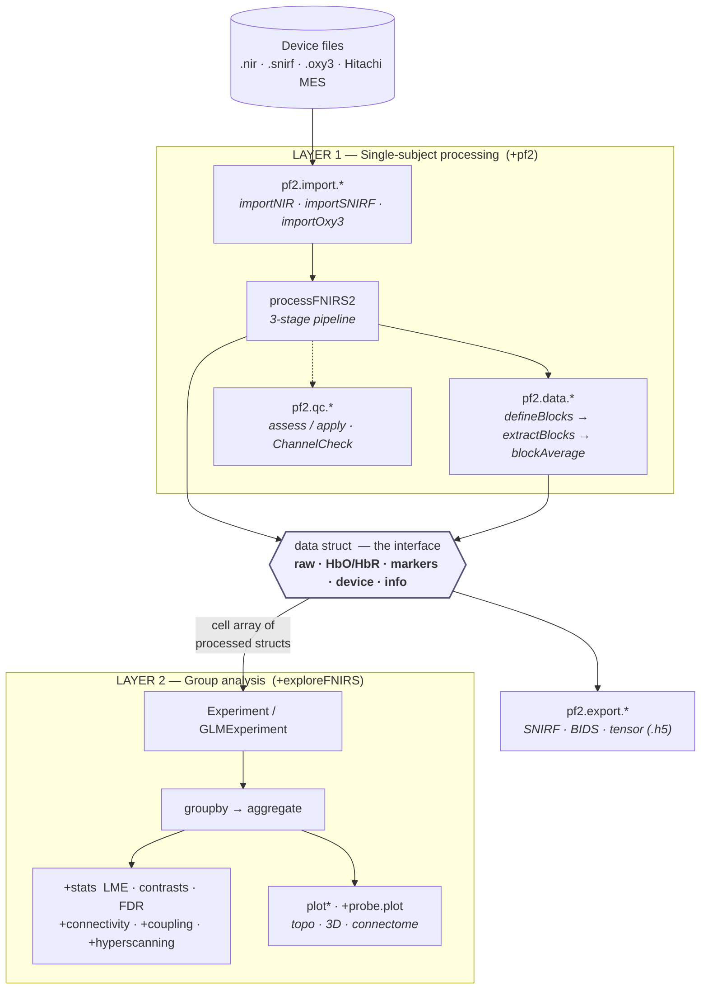
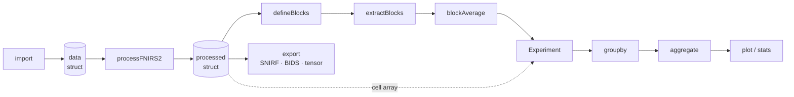
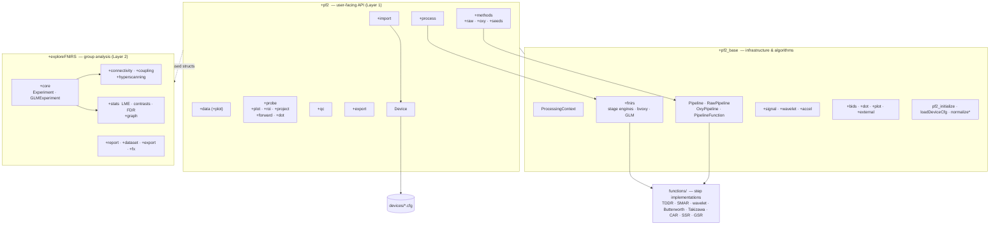

# Architecture

A tour of how processFNIRS2 is put together — enough to understand the data
flow, find your way around the packages, and know where new code belongs. For
the public API see [API_REFERENCE.md](API_REFERENCE.md); for the processing
methods see [PROCESSING_PIPELINE.md](PROCESSING_PIPELINE.md).

## Two layers

processFNIRS2 is organized as two layers with a deliberately simple boundary
between them:

The contract between the layers is **a plain MATLAB struct** (one per
recording) — not a class hierarchy or a database. Layer 1 produces it; Layer 2
consumes a cell array of them. This is what makes the whole toolbox scriptable
and testable, and lets external tools interoperate by producing/consuming the
same struct.

## End-to-end call flow

A single recording travels through the toolbox like this:

1. **Import** — `pf2.import.importNIR` / `importSNIRF` / `importOxy3` / … reads a
   device file and returns the data struct: `raw`, `time`, `fs`, `fchMask`, a
   `markers` table, `info`, and a `device` object (auto-attached via
   `pf2_base.loadDeviceCfg`). SNIRF import also folds BIDS `events.tsv` into the
   marker dictionary.

2. **Process** — `processFNIRS2(data)` runs three stages (below) and returns the
   same struct with `HbO`, `HbR`, `HbTotal`, `HbDiff`, `CBSI`, plus `units`,
   `DPF_factor`, and a `processingInfo` record for reproducibility.

3. **Epoch (single-subject)** — `pf2.data.defineBlocks` turns marker codes into
   block definitions; `pf2.data.extractBlocks` cuts time-locked segments;
   `pf2.data.blockAverage` / `grandAverage` produce trial-averaged waveforms.

4. **Group analysis (Layer 2)** — a cell array of processed structs becomes an
   `exploreFNIRS.core.Experiment`; `groupby` + `aggregate` build the group
   tensors; `plot*` and the `+stats` engine produce figures and LME results.

5. **Export** — `pf2.export.asSNIRF` / `asBIDS` / `asTensor` serialize the struct
   for sharing or downstream ML.

## The data struct is the interface

Because every stage reads and writes the same struct, its fields are the most
important contract in the codebase. Treat them as stable.

| Field | Meaning |
|-------|---------|
| `raw` `[T×C]` | Raw light intensity (input). |
| `time` `[T×1]`, `fs` | Time vector (s) and sampling rate (Hz). |
| `fchMask` `[1×C]` | Channel mask (1 = good, 0 = bad). |
| `markers` (table) | `Time, Code, Duration, Amplitude` (+ any extra columns you add). Read by name. |
| `info` | Metadata; `info.markerDict` (code→label), `info.eventTypes` (BIDS), subject fields. |
| `device` | `pf2.Device` value object — geometry, wavelengths, saturation bounds. |
| `Aux` | Optional typed auxiliary signals (HR, EKG, accel, …). |
| `HbO` `HbR` `HbTotal` `HbDiff` `CBSI` `[T×C]` | Hemoglobin biomarkers (output). |
| `units`, `DPF_factor`, `processingInfo` | Units, DPF used, and the full processing record. |

Two sub-contracts worth calling out:

- **Markers are a table**, not a matrix — `data.markers.Code`, never column
  indexing. Extra columns (e.g. `RT`, `Label`) survive `setT0`, `split`,
  `extractBlocks`, and processing. Helpers: `pf2_base.normalizeMarkers`,
  `markersToArray`, `mergeMarkers`.
- **The marker dictionary** `info.markerDict` gives codes meaning and is the
  unifying target for source formats (BIDS `events.tsv`, COBI logs).
  `defineBlocks` and `labelMarkers` read it.

## The three-stage processing pipeline

`processFNIRS2` converts raw intensity to filtered hemoglobin in three stages,
implemented in `+pf2_base/+fnirs`:

| Stage | Engine | Transform |
|-------|--------|-----------|
| 1 | `processStageRaw2OD` | Raw intensity → optical density (motion correction, filtering, CAR — the configurable **raw** method chain). |
| 2 | `processStageOD2Hb` / `bvoxy` | Optical density → `HbO`/`HbR`/… via the modified Beer-Lambert law, with DPF correction (None / Fixed / age-dependent Calc). |
| 3 | `processStageFilterHb` | Hemoglobin → filtered hemoglobin (the configurable **oxy** method chain). |

Stages 1 and 3 are **method chains**: ordered lists of step functions (from
`functions/`) whose arguments are bound *by name* from the processing context
(`x`, `fs`, `fTime`, `fchMask`, …). The same chains are also expressible as
first-class `RawPipeline` / `OxyPipeline` value objects (see below).

## Package map

### `+pf2/` — user-facing API (Layer 1)
| Subpackage | Responsibility |
|------------|----------------|
| `+import` | Device readers (`importNIR`, `importSNIRF`, `importOxy3`, …), `importDirectory`, `fromTable`, `sampleData`. |
| `+data` | Struct manipulation (`setT0`, `resample`, `split`), epoching (`defineBlocks`, `extractBlocks`, `blockAverage`), markers, metadata; `+plot` for time series. |
| `+process` | Stage-level entry points (`processRaw`, `processOxy`). |
| `+methods` | Method registry — `+raw`, `+oxy`, `+seeds` (list/set/create/edit). |
| `+probe` | Anatomy & spatial viz — `+plot` (topo, 3D, movies, connectome), `+roi`, `+project`, `+forward` & `+dot` (diffuse optical tomography), `canonicalize`, `montage`. |
| `+qc` | Quality control — `pipeline.assess/apply`, `snapshot`, `ChannelCheck` GUI. |
| `+export` | `asNIR`, `asSNIRF`, `asBIDS`, `asTensor`, `export`. |
| `+settings`, `+GUI` | Processing settings and GUI glue. `Device.m` (top level) is the device value class. |

### `+pf2_base/` — internal infrastructure & algorithms
Top-level: `ProcessingContext`, the pipeline classes (`Pipeline`,
`RawPipeline`, `OxyPipeline`, `PipelineFunction`), `pf2_initialize`,
`loadDeviceCfg`, `normalizeMarkers`/`normalizeAux`, `hierarchicalAverage`.
Subpackages include `+fnirs` (the stage engines, `bvoxy`, GLM), `+dot`, `+bids`,
`+accel`, `+signal`, `+wavelet` (first-party transforms), `+plot`, `+external`
(vendored helpers), and `+tests`.

### `+exploreFNIRS/` — group analysis (Layer 2)
`+core` holds the scriptable `Experiment` and `GLMExperiment` classes plus their
plotting methods. Analysis subpackages: `+connectivity`, `+coupling`,
`+hyperscanning`, `+stats` (LME, contrasts, FDR), `+graph`, `+report`,
`+dataset`, `+export`, `+fx`.

### Supporting directories
`functions/` — flat signal-processing step implementations (TDDR, SMAR,
wavelet, Butterworth, Takizawa, …), dispatched by name from the method chains.
`devices/` — device `.cfg` files. `sampledata/` — bundled datasets.
`examples/scripts/` — runnable tutorials.

### Entry points & legacy zones
- `processFNIRS2.m` — the processing engine (handles cell arrays, `parfor`, and
  the `Context` bypass).
- `pf2.m` — convenience wrapper that self-heals the path.
- `exploreFNIRS.m` — the GUIDE-based group-analysis GUI.
- `base_functions/`, `GUI/`, `compat_shims/` — **legacy / compatibility code
  outside the package structure.** Kept working, but new code should not be added
  here.

## Key abstractions

- **`pf2.Device`** — an immutable value object describing a probe (geometry,
  wavelengths, MNI positions, saturation bounds), loaded from a `.cfg` and
  attached as `data.device`.
- **Method / Pipeline system** — a method is a named, ordered chain of step
  functions. `RawPipeline`/`OxyPipeline` expose this as value objects (every
  mutating call returns a copy); `.toMethod()`/`.save()` convert to the registry
  format, `.fromMethod()` reloads.
- **`ProcessingContext`** — bypasses the `PF2`/`setF` globals so settings,
  methods, and device are threaded as locals. This is what makes processing
  isolated, reproducible, and `parfor`-safe (`processFNIRS2(data, 'Context', ctx)`).
- **`Experiment` / `GLMExperiment`** — the Layer-2 group objects: ingest
  processed structs, `groupby`/`aggregate` into group tensors, and expose
  `plot*` and statistics. `GLMExperiment` wraps processing + GLM + group analysis.

## Where does X go?

| You want to add… | Put it here |
|------------------|-------------|
| A processing algorithm / step | `functions/` (a plain function bound by name), then register it in a method chain or add it to a `RawPipeline`/`OxyPipeline`. |
| A device | A `.cfg` in `devices/` (or generate one with `pf2.probe.saveCfg`). |
| An importer / exporter | `+pf2/+import` / `+pf2/+export`. |
| A plot or spatial visualization | `+pf2/+probe/+plot` (or `+project` for cortical projections). |
| A QC check | `+pf2/+qc` (wire it into `pipeline.assess`). |
| Group-level analysis or statistics | `+exploreFNIRS/+core` (Experiment methods) or the relevant analysis subpackage (`+connectivity`, `+stats`, `+graph`, …). |
| Internal infrastructure / shared utility | `+pf2_base` (the right subpackage). |
| Tests | `+pf2_base/+tests`. |

See [CONTRIBUTING.md](https://github.com/AdrianCurtin/processFNIRS2/blob/master/CONTRIBUTING.md)
for setup, tests, and coding conventions.
